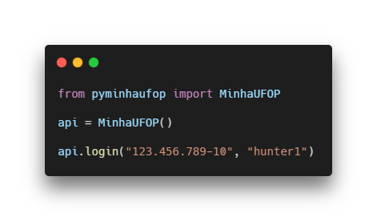

<div align="center">
	<a href="https://pypi.org/project/pyminhaufop/" target="_blank">
    	
    </a>
    </div>

<h3 align="center">pyMinhaUFOP</h3>
<p align="center">Wrapper não-oficial para a API mobile da MinhaUFOP</p>

<div align="center">
  
  <a href="https://pypi.org/project/pyminhaufop/" target="_blank"></a>
  
</div>

<br/>

<h5 align="center"> 
🚧 Em desenvolvimento 🚧
</h5>

---

<p align="center">
    <a href="#o-que-é">❓ O que é?</a> •
    <a href="#instalação">💻 Instalação</a> • 
    <a href="#uso-e-exemplos">✍️ Uso e Exemplos</a> •
    <a href="#roadmap">🗺️ Roadmap</a>
</p>

## O que é?
Este wrapper expõe a API Mobile do Aplicativo [Minha UFOP](https://play.google.com/store/apps/details?id=br.ufop.app).

## Instalação


#### Automático (recomendado)

```
$ pip install pyminhaufop --upgrade
```

#### Manual

1. Clone este repositório
2. ```$ python setup.py install```

<br/>

> Lembre-se de manter a biblioteca sempre atuaizada.

## Uso e Exemplos

### Login
#### simples
```python
from pyminhaufop import MinhaUFOP

# inicializa a classe
api = MinhaUFOP()

# Logue e gere o token
api.login('123.456.789-10', 'sua_senha')

# acesse as funções da API
saldo = api.saldo_do_ru()
print(saldo['saldo'])
```

#### com senha hasheada
```python
from pyminhaufop import MinhaUFOP

# inicializa a classe
api = MinhaUFOP()

# Logue usando uma senha hasheada em MD5
api.login('123.456.789-10', 'sua_senha_em_MD5', encode=False)

# acesse as funções da API
saldo = api.saldo_do_ru()
print(saldo['saldo'])
```

#### utilizando conta com mais de um perfil
```python
from pyminhaufop import MinhaUFOP

# inicializa a classe
api = MinhaUFOP()

# Você pode passar os dados de forma direta
# identificacao = matrícula com pontos
# perfil = 
#        - "G" - Alunos de Graduação
api.login('123.456.789-10', 'sua_senha', identificacao="20.1.0000", perfil="G")

# ou 

# Indique o index do perfil. O mais recente é o index 0.
api.login('123.456.789-10', 'sua_senha', perfil_num=0)
```

### RU
#### Saldo
```python
saldo = api.saldo_do_ru()

print(saldo)
# >> {'cpf': '123.456-789-10', 'saldo': 1.0, 'bloqueado': False}
```

#### Cardápio
```python

# Acessar cardápio da semana
cardapio = api.cardapio_do_ru()

# Acessar cardápio de um dia específico na semana
# dia_da_semana: int =
#                      - 0 = Segunda
#                      - ...
#                      - 4 = Sexta
cardapio = api.cardapio_do_ru(dia_da_semana=0)

print(cardapio)
# >> [{'almoco': {'opma': [ ... }]
```

#### Extrato
```python

extrato = api.extrato_ru(inicio='2020-01-01', fim='2020-08-01')

print(extrato)
# >> [{
#   "data":"2020-03-11 12:42:50",
#   "dataGravacao":"2020-03-11 12:42:52",
#   "valor":3.00,
#   "codCategoriaBolsa":null,
#   "tipo":"D",
#   "pagante":true}]
```

### Salvar foto de um CPF
```python
# Salva a foto do CPF como teste.png
api.foto('123.456.789-10', 'teste.png')

# Salva a foto e etorna o caminho onde foi salva
foto = api.foto('123.456.789-10')
print(foto)
# 123.456.789-10.png
```

### Atestado de Matrícula
```python

atestado = api.atestado()

print(atestado)
# >> [{'ano': '2020',
#      'semestre': 1,
#      'dia': 2,
#      'horaInicio': '19:00:00',
#      'codDisciplina': 'XXX000',
#      'codTurma': '69',
#      'tipoAula': 'T',
#      'descricao': 'Matéria',
#      'credito': 4,
#      'chSemestre': 60}]
```

## Roadmap

### Funções nativas

- [x] Login `v0.0.1`
- [x] Consulta de Saldo do RU `v0.0.1`
- [x] Consulta de foto pelo CPF `v0.0.2`
- [x] Consulta ao Cardápio do RU `v0.1.0`
- [ ] Boletos
    - [ ] Emissão
    - [ ] Download
    - [ ] Listagem
- [x] Consulta ao Atestado de Matrícula `v0.2.0`
- [x] Consulta ao Extrato do RU `v0.2.0`