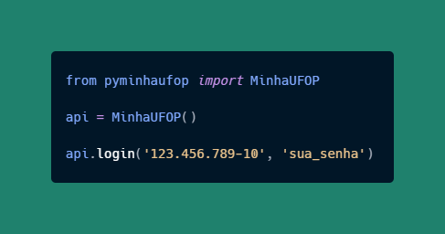

<div align="center">
	<a href="https://pypi.org/project/pyminhaufop/" target="_blank">
    	
    </a>
    </div>

<h1 align="center">pyMinhaUFOP</h1>
<p align="center">Wrapper não-oficial para a API mobile da MinhaUFOP</p>

<div align="center">
  
  <a href="https://pypi.org/project/pyminhaufop/" target="_blank"></a>
  
</div>

<br/>

<h5 align="center"> 
🚧 Em desenvolvimento 🚧
</h5>

---

<p align="center">
    <a href="#o-que-é">❓ O que é?</a> •
    <a href="#instalação">💻 Instalação</a> • 
    <a href="#uso">✍️ Uso e Exemplos</a> •
    <a href="#roadmap">🗺️ Roadmap</a>
</p>

## O que é?
Este wrapper expõe a API Mobile do Aplicativo [Minha UFOP](https://play.google.com/store/apps/details?id=br.ufop.app).

## Instalação


#### Automático (recomendado)

```
$ pip install pyminhaufop --upgrade
```

#### Manual

1. Clone este repositório
2. ```$ python setup.py install```

<br/>

> Lembre-se de manter a biblioteca sempre atuaizada.

## Uso e Exemplos

#### Login simples
```python
from pyminhaufop import MinhaUFOP

# inicializa a classe
api = MinhaUFOP()

# Logue e gere o token
api.login('123.456.789-10', 'sua_senha')

# acesse as funções da API
saldo = api.saldo_do_ru()
print(saldo['saldo'])
```

#### Login com senha hasheada
```python
from pyminhaufop import MinhaUFOP

# inicializa a classe
api = MinhaUFOP()

# Logue usando uma senha hasheada em MD5
api.login('123.456.789-10', 'sua_senha_em_MD5', encode=False)

# acesse as funções da API
saldo = api.saldo_do_ru()
print(saldo['saldo'])
```

#### Login com mais de um perfil
```python
from pyminhaufop import MinhaUFOP

# inicializa a classe
api = MinhaUFOP()

# Logue e selecione um dos perfis. Mais recente primeiro.
api.multi_perfil_login('123.456.789-10', 'sua_senha_em_MD5', perfil=0)

# acesse as funções da API
saldo = api.saldo_do_ru()
print(saldo['saldo'])
```

#### Salvar foto de um CPF
```python
# Salva a foto do CPF como teste.png
api.foto('123.456.789-10', 'teste.png')

# Salva a foto e etorna o caminho onde foi salva
foto = api.foto('123.456.789-10')
print(foto)
# 123.456.789-10.png
```

## Roadmap

### Funções nativas

- [x] Login `v0.0.1`
- [x] Consulta de Saldo do RU `v0.0.1`
- [x] Consulta de foto pelo CPF `v0.0.2`
- [ ] Consulta ao Cardápio do RU
- [ ] Emissão de boletos de recarga
- [ ] Consulta ao Atestado de Matrícula
- [ ] Consulta ao Extrato do RU